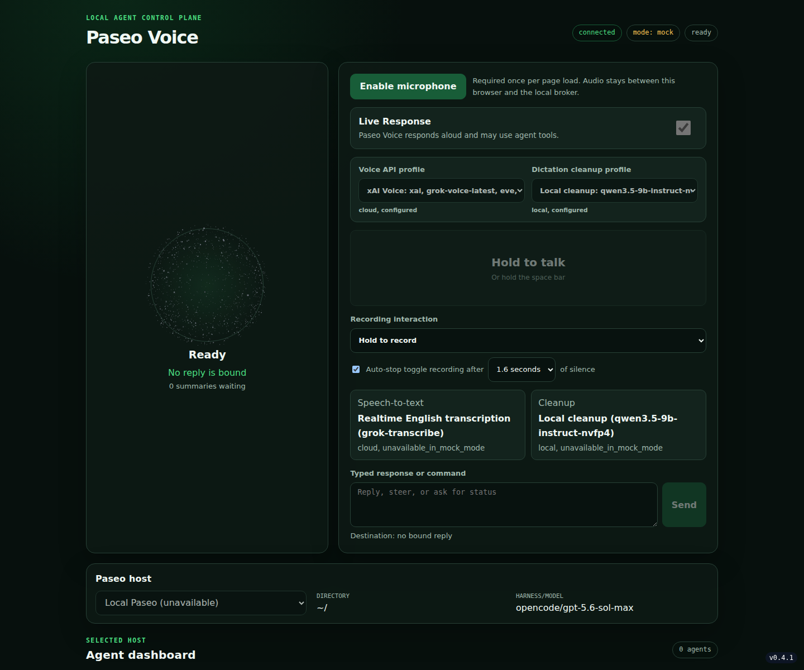

<p align="center">
  
</p>

# Paseo Voice Agent

Paseo Voice is a local push-to-talk and dictation interface for Paseo coding-agent sessions. A
Rust broker connects a secret-free browser to Paseo and OpenAI Realtime while keeping every write
behind an explicit proposal and confirmation gate.



The project is early alpha. It is intended for local or private-host use and is not ready for
direct public-network exposure.

## Current state

The current application provides:

- A browser dashboard with trusted Paseo host profiles, session selection, typed steering, and
  push-to-talk voice interaction.
- Manual reading and opt-in automatic announcement of the latest agent reply. The reply becomes an
  immutable response context tied to its source session.
- Provenance-bound response proposals and broker-gated session creation. In the browser, only the
  explicit Confirm control can execute a proposal; the local console has a separate deterministic
  text confirmation path.
- English dictation that transcribes, cleans, and inserts text into the bound draft without
  producing an assistant response or submitting a write.
- Barge-in, summary replay, microphone selection, hold and toggle recording, local shortcuts, a
  WebGL avatar with CSS fallback, and accessible text states.
- A content-free SQLite operation journal and conservative recovery for attempted writes.
- A text-only mock browser runtime and deterministic local console.

When `autoReplyPollMs` is nonzero, each live browser connection polls its selected Paseo host and
treats a visible non-idle to idle transition as a completed reply. It reads and binds that reply,
then asks OpenAI Realtime to summarise and speak it with tools disabled. This is an alpha fallback:
fast transitions may be missed, concurrent browsers may announce the same reply, and identical reply
text is deduplicated by its synthetic digest. Manual reads remain available. After a connection
closes gracefully, the broker can give its committed content-free deduplication snapshot to a later
connection. No queue state survives a broker restart.

## Requirements

Node.js and Rust are required to build and start the repository. The remaining dependencies enable
full live functionality; mock mode can start without them.

- Node.js 26 or newer and pnpm 11.13.1 for repository tooling
- Rust 1.97.0 through `rustup`
- A working `paseo` CLI for session operations
- An OpenAI API key for the official Realtime endpoint
- An OpenAI-compatible chat-completions endpoint for optional reply summaries and dictation cleanup
- Bitwarden Secrets Manager CLI, 1Password CLI, or process environment variables for secrets

With the official Realtime endpoint, a missing OpenAI key selects text-only mock mode. A
credential-free custom endpoint can run live. Set `forceMock` or `PASEO_VOICE_MOCK=true` to disable
outbound Realtime connections in every case.

## Quick start

```bash
pnpm install --frozen-lockfile
pnpm check
pnpm build
pnpm start
```

Open `http://localhost:8790`. Microphone access normally requires `http://localhost` or HTTPS.

Use the local text interface with:

```bash
pnpm console
```

## Configuration

Configuration precedence is environment variables, then the JSON file, then built-in defaults.
The default file is `~/.config/paseo-voice/config.json`; override it with `PASEO_VOICE_CONFIG`.
Start from [config.example.json](config.example.json).

`paseoHosts` defines the broker-owned host selector. Exactly one profile must be the default. The
browser receives safe labels and creation defaults, while daemon targets and credentials remain in
Rust.

```json
{
  "paseoHosts": [
    {
      "id": "local",
      "label": "Local Paseo",
      "target": null,
      "default": true,
      "defaultCwd": "~/",
      "defaultProvider": "opencode/gpt-5.6-sol-max"
    }
  ]
}
```

Paths are passed unchanged for expansion by the selected Paseo daemon. The legacy
`PASEO_VOICE_PASEO_HOST` override changes the target of the configured default profile only.

Set `autoReplyPollMs` to `1000` for the alpha automatic announcement fallback, or leave it at `0`
to disable polling. The equivalent environment override is `PASEO_VOICE_AUTO_REPLY_POLL_MS`.

### Secrets

Select one provider for the process with `secretProvider` or
`PASEO_VOICE_SECRET_PROVIDER`: `bitwarden`, `onepassword`, or `environment`. Bitwarden is the
default.

- `environment` reads `OPENAI_API_KEY`, `PASEO_VOICE_SPARK_API_KEY`, and `PASEO_PASSWORD`. Start
  from [.env.example](.env.example) and load it through your shell or secret manager; the
  application does not load `.env` files.
- `bitwarden` reads a Secrets Manager token from `~/.config/bws.env` and resolves the configured
  `bwsSecretIdOpenai` and `bwsSecretIdPaseo` values.
- `onepassword` resolves the configured `onePasswordSecretRefOpenai` and
  `onePasswordSecretRefPaseo` references through `op read`.

`PASEO_VOICE_SPARK_API_KEY` always supplies only the model-endpoint bearer. It is a narrow
environment input even when Bitwarden or 1Password supplies the OpenAI and Paseo credentials, and
it is not forwarded to their child processes.

Secrets are resolved once at startup. Missing OpenAI credentials affect Realtime only; missing
Paseo credentials disable Paseo tools without preventing the server from starting. Restart after
secret rotation.

### Endpoint policy

The OpenAI bearer token is sent only to the exact official Realtime endpoint. The separate Spark
bearer is sent only through the model HTTP client used for summarisation and dictation cleanup.
Plain `ws://` is accepted only on loopback. Plain model `http://` is accepted on loopback, or for a
Tailscale IPv4 address when `allowInsecureTailscaleSpark` or
`PASEO_VOICE_ALLOW_INSECURE_TAILSCALE_SPARK=true` explicitly opts in. Other remote endpoints
require `wss://` and `https://`. Model redirects and ambient HTTP proxy discovery are disabled.

## Safety model

The browser, model, transcription, tool arguments, display labels, and CLI output are untrusted.
Rust owns the credentials, immutable reply provenance, proposal state, and only Paseo write path.

- A response proposal accepts text but no destination. Rust derives the destination from the reply
  context created by the last successful read.
- Changing host or reply context invalidates the draft and proposal instead of retargeting them.
- The Realtime model cannot confirm a write. Browser confirmation requires the exact current
  presentation and a later trusted interaction; the local console uses a separate trusted text
  path.
- Each confirmation makes at most one Paseo process attempt. Any uncertain post-spawn result is
  `outcome_unknown` and is never retried automatically.
- Runtime-generated durable state excludes transcripts, summaries, response bodies, prompts, agent
  output, and credentials. Operator-managed secret-provider files remain outside that journal.

See [docs/RUST_SAFETY_CONTRACT.md](docs/RUST_SAFETY_CONTRACT.md) for the normative invariants.

## Commands

| Command           | Purpose                                                 |
| ----------------- | ------------------------------------------------------- |
| `pnpm build`      | Build the Rust workspace in release mode                |
| `pnpm check`      | Run formatting, lint, browser and Rust tests, and build |
| `pnpm console`    | Open the Rust text console                              |
| `pnpm format`     | Format tracked source and documentation                 |
| `pnpm lint`       | Lint browser JavaScript and tooling                     |
| `pnpm rust:build` | Build the Rust workspace in release mode                |
| `pnpm rust:lint`  | Run Clippy across the Rust workspace                    |
| `pnpm rust:test`  | Run all Rust tests                                      |
| `pnpm start`      | Start the Rust broker and browser                       |
| `pnpm test`       | Run browser JavaScript and Rust tests                   |

## Project layout

- `crates/paseo-safety-core/`: pure provenance, queue, proposal, and confirmation state
- `crates/paseo-control-plane/`: Rust runtime, adapters, protocol, and tests
- `public/`: secret-free browser client with no build step
- `docs/IMPLEMENTATION.md`: current runtime architecture
- `DECISIONS.md`: short architectural history and unresolved boundaries
- `docs/agents/`: operational state, publish boundary, and agent playbooks

## Current limits

- Automatic completion uses an opt-in status-polling heuristic until Paseo exposes stable markers
- No exactly-once delivery claim until Paseo supports receiver-recognised idempotency
- No authenticated remote broker transport or configured public web deployment
- No durable transcript, summary, draft, response, or cancelled-proposal history
- No per-host credentials or editable new-session provider, model, and directory controls
- No custom cleanup prompts, vocabulary, snippets, correction learning, or desktop companion

## Contributing

Read [CONTRIBUTING.md](CONTRIBUTING.md) before opening a pull request. Coding agents must also follow
[AGENTS.md](AGENTS.md).

## License

[MIT](LICENSE)
